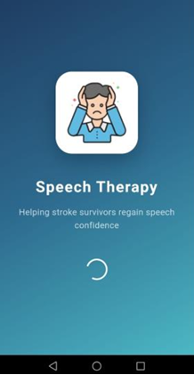
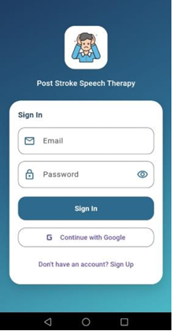
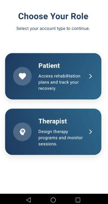
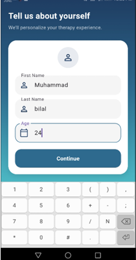
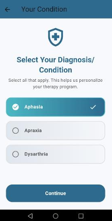
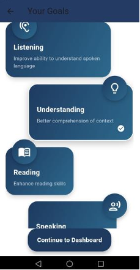
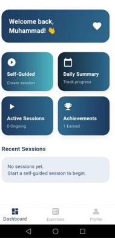
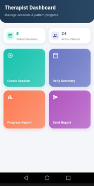

# Post-Stroke Speech Therapy App

A Flutter and Firebase-based mobile application designed to help post-stroke patients practice speech therapy exercises.
The app provides a simple, user-friendly interface and securely tracks patient progress using Firebase.

## ✨ Features

- User Authentication
- Speech Therapy Exercises
- Real-Time Progress Tracking
- Clean & Responsive UI
- Firebase Cloud Database

## 🛠️ Tech Stack

- Flutter
- Dart
- Firebase Authentication
- Cloud Firestore
- Firebase Storage

## 📸 Screenshots

### Splash Screen

### Login Screen

### choose you role

### tell us about yourself

### select condition

### your goal

### patient dashboard

### therapist dashboard

